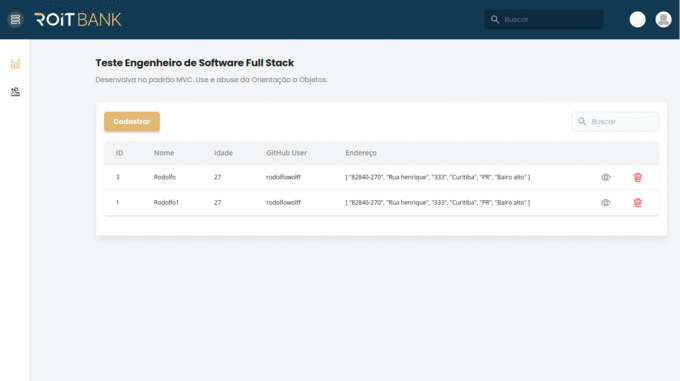

<p align="center">
  
</p>

## Description

Dashboard ADMIN Vue 3 + Vite and Tailwind css.

## Installation

```bash
$ yarn
```

## Running the app

```bash
# development
$ yarn dev
```

## Features and Observations

- [ ] - Create User
- [x] - Read User
- [ ] - Update User
- [x] - Delete User

# Next steps
- Unitary tests
- Zip (viacep)
- User (github)
- Authentication system (JWT)
- Change language (i18n)
- mobile (the search needs to be fixed)
